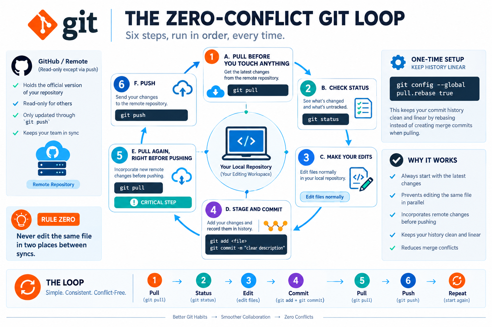

# Git Best Practices

A small, growing collection of reference guides for clean, predictable git usage — written up as standalone visual pages rather than plain docs.



## Guides

| Guide | What it covers |
|---|---|
| [Zero-Conflict Git Loop](https://elixirman.github.io/git-best-practices/merge-conflict-prevention/) | The pull → status → edit → commit → pull → push loop that prevents merge conflicts before they happen |

## Why this exists

Most git advice is either a wall of text or a cheat sheet you forget you bookmarked. Each guide here is built as a single, self-contained, visual reference — something you can actually open and follow along with mid-task, not just read once.

## Running a guide locally

Each guide is a self-contained HTML file. Open it directly in a browser, or serve the folder:

```bash
cd merge-conflict-prevention
python3 -m http.server 8000
# then visit http://localhost:8000
```

## License

MIT — see [LICENSE](LICENSE).
